# `ML-Kit demo` Android app

[ML-Kit](https://developers.google.com/ml-kit) is a free-to-use machine learning API for Android and
iOS apps, focusing
on <b>on-device</b> AI solutions. 
In this repo, I have made a demo of all the AI techniques I have performed with ML-Kit on Android.

The ML techniques used in this demo app include but are not limited to:
<ol>
<li><h3>Face mesh detection</h3></li>
This algorithm detects face mesh info on close-range images.
 
 
Example results:
 
 
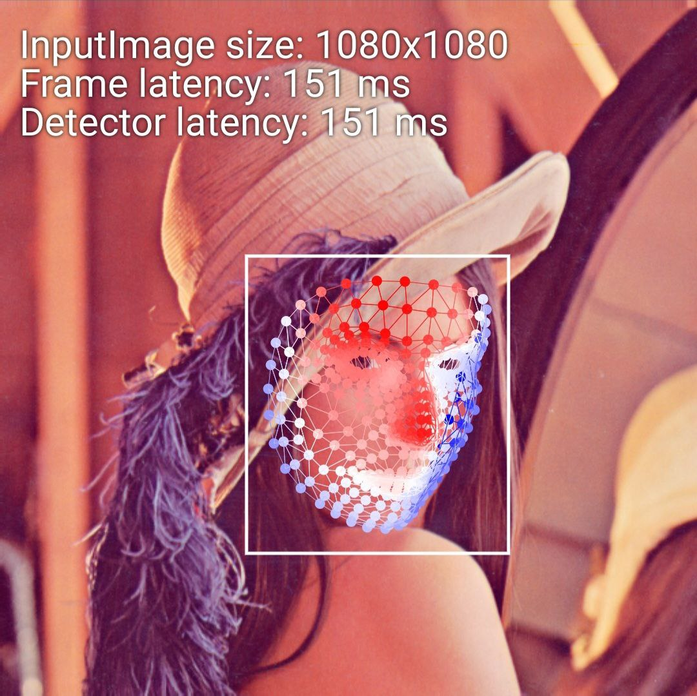
<li><h3>Text recognition</h3></li>
This algorithm can recognize and extract text from images.
 
 
Some examples: 
 
 
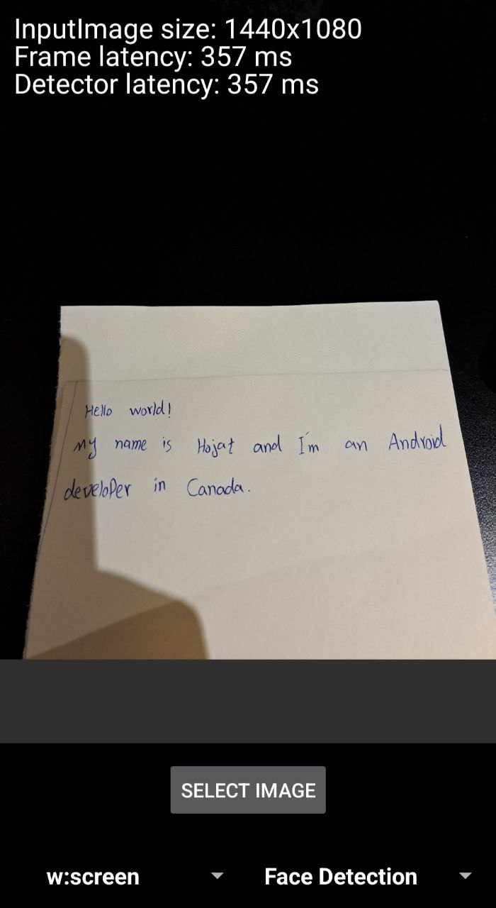
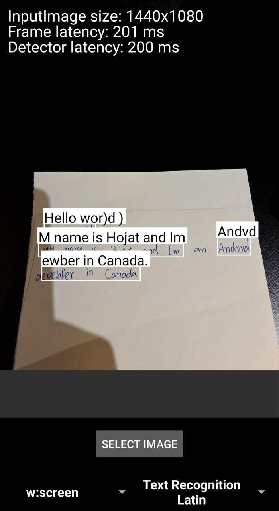
<li><h3>Pose detection</h3></li>
Detecting the position of human body in any given picture/video in real-time.
 
 
Example result:
 
 
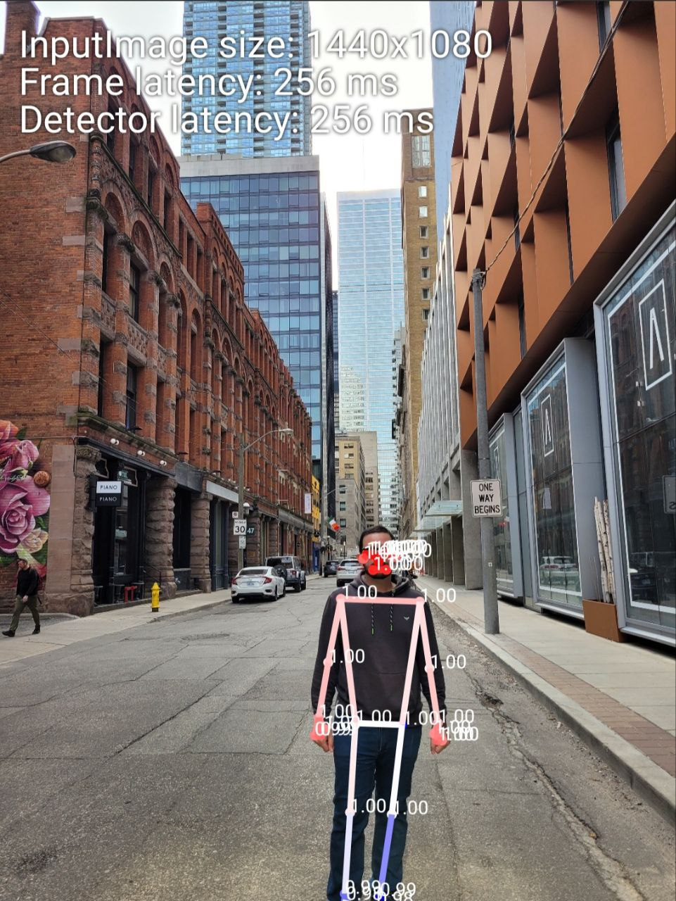
<li><h3>Selfie segmentation</h3></li>
Separates the background of a picture/video from users within it. Helps to focus on more important objects in the picture/video.
 
 
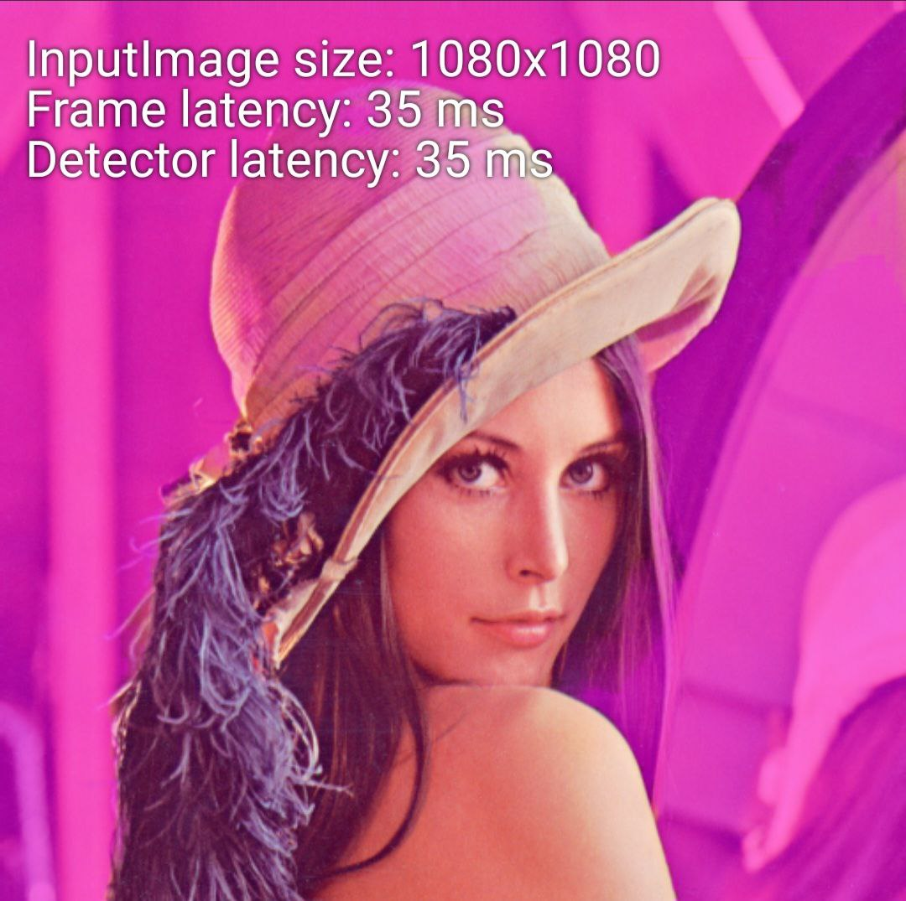

 
 
<li><h3>Object detection</h3></li>
Localize and tag in realtime one or more objects in the live camera feed.
 
 
Example results of object detection:
 
 

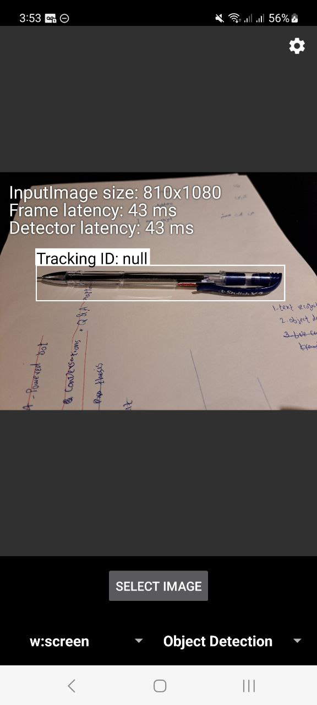
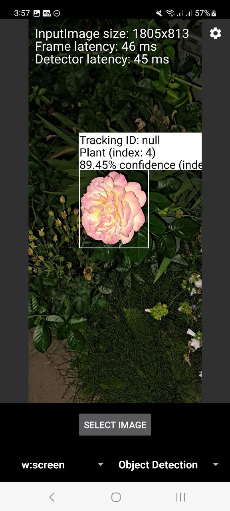
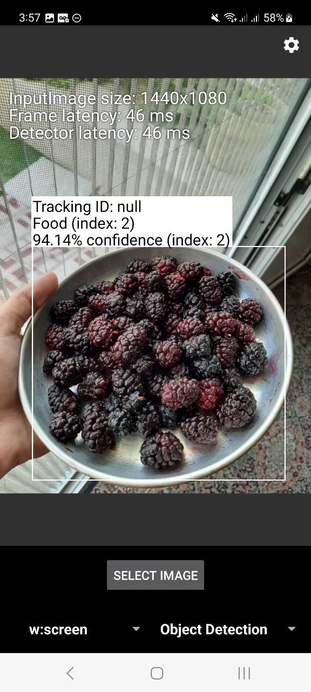
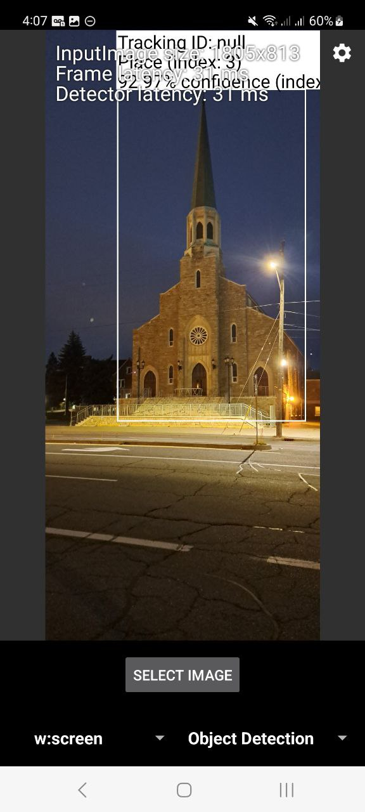
<li><h3>Barcode scanner</h3></li>
Scanning and processing most kinds of barcodes. Supports various standard 1D and 2D (a.k.a. QR) barcode formats.
 
 
Example result of barcode scanner:
 
 
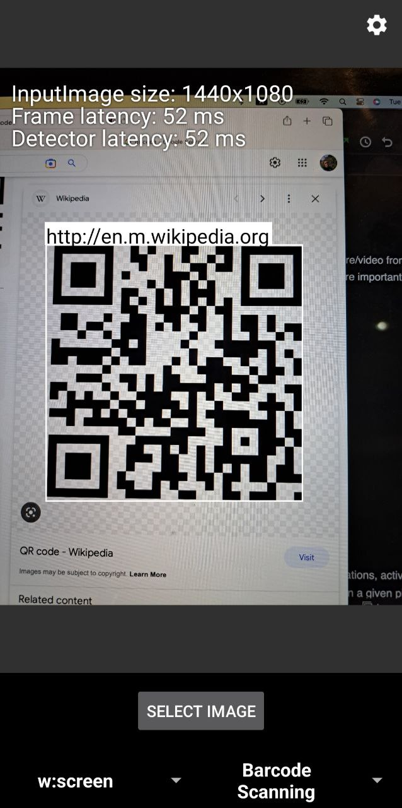
 
 
A video demo of barcode scanner:
 

<b>Realtime barcode scanner video demo</b>

https://user-images.githubusercontent.com/8706521/231256249-17ea1166-c330-4a24-9889-1bb8b0100fae.mp4

<li><h3>Image labeling</h3></li>
This algorithm identifies objects, locations, activities, animal species, products and more in a given picture. 
For example, in the picture below, it has managed to label the <b>road</b>, <b>Jeans</b>, <b>Jacket</b>, and <b>Building</b>s in the picture correctly.
 
 
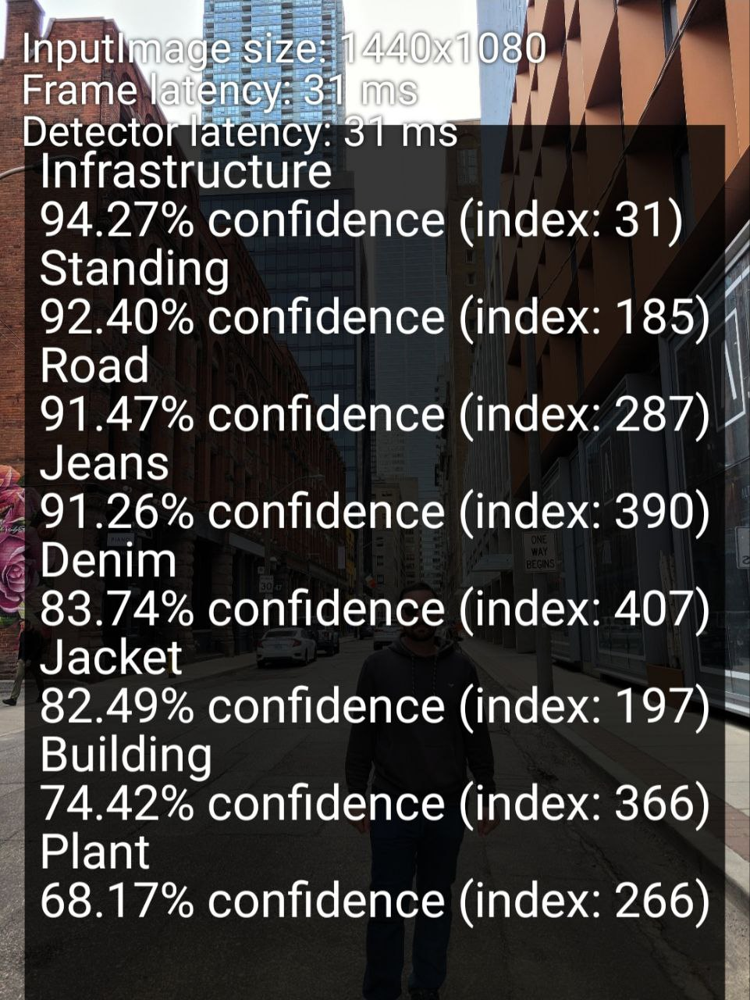
<li><h3>Face detection</h3></li>
Detects faces and facial landmarks in a given image/video.
 
 
Example results:
 
 
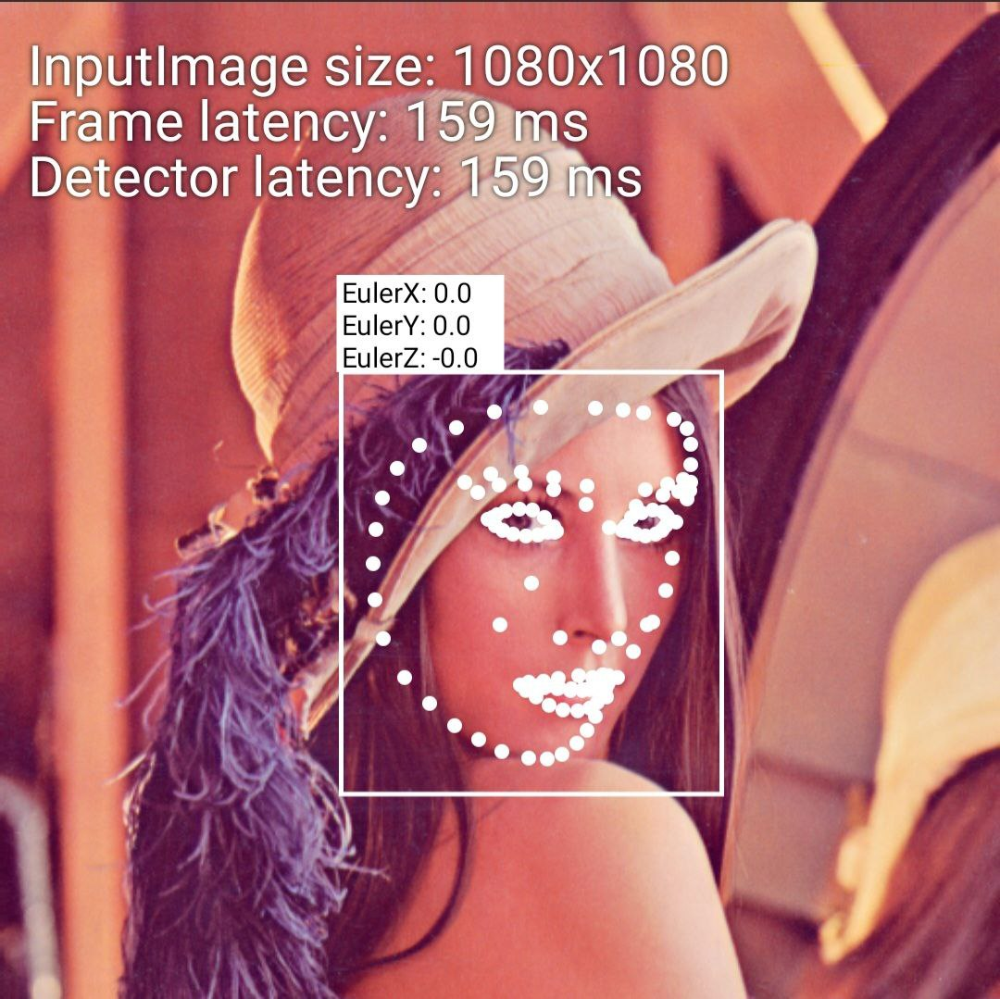
<li><h3>Live Camera translator</h3></li>
This amazing demo camera app firstly determines the language of a string of text with just a few words. And then, translates that text between 58 languages; completely on device. 
 
 
A video demo of realtime camera translator:
 

<b>Live camera translator video demo</b>

https://user-images.githubusercontent.com/8706521/231260485-a44a559e-6e96-4fd3-aae5-b897d7442d5b.mp4

<li><h3>Digital ink recognition</h3></li>
This part of the app recognizes handwritten text and hand-drawn shapes (such as emojis) on a digital surface, such as a touch screen. 
 
 
Some examples:
 
 
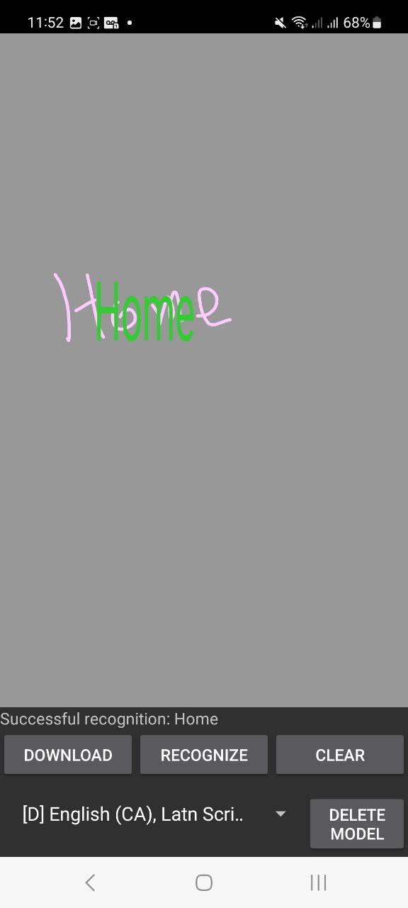
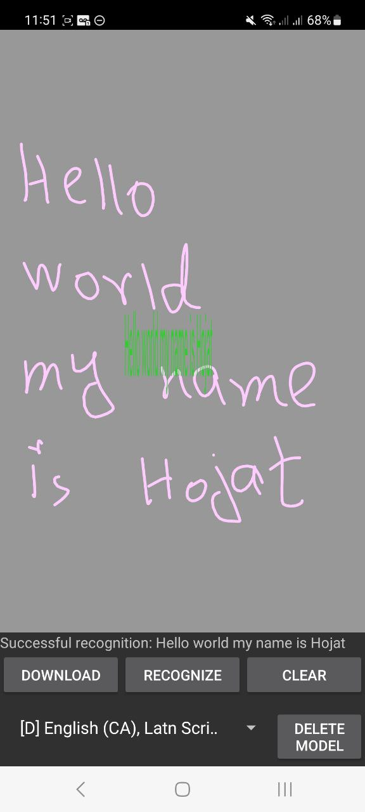
 
 
A video demo of digital ink recognition:
 

<b>Digital ink recognition video demo</b>

https://user-images.githubusercontent.com/8706521/231075026-13e46bb5-c3b5-4e77-8fad-ed2a72e66c89.mp4

</ol>

### Development:

Please star and fork this repo, I will be maintaining it over time and will try to add more ML
related library demos to
it. 
Feel free to open issues and point out the bugs and short-comings.

new architecture of the app is going to be like this:
we will have these 5 main modules in our codebase:
<ol>
<li>feature_ink_recognition</li>
<li>feature_live_translator</li>
<li>feature_still_image</li>
<li>feature_live_preview</li>
<li>shared</li>
</ol>